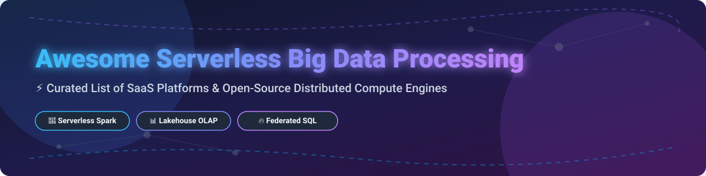

# Awesome Serverless Big Data Processing ⚡

  

  
  
  
  
  

Welcome to the ultimate curated resource for **Serverless Big Data Processing**, **Elastic Distributed Compute Engines**, **Cloud Data Lakes & Lakehouses**, and **Distributed SQL Engines**. This list tracks enterprise-grade SaaS analytics platforms and production-ready open-source GitHub projects designed to process petabyte-scale data without infrastructure management headaches.

---

## 📑 Table of Contents 

- [☁️ SaaS & Managed Cloud Platforms](#-saas--managed-cloud-platforms)
- [🔓 Open-Source GitHub Projects](#-open-source-github-projects)
  - [⚡ Distributed Processing & Compute Engines](#-distributed-processing--compute-engines)
  - [🔍 Federated SQL Query Engines](#-federated-sql-query-engines)
  - [🏛️ Analytical Databases & OLAP](#%EF%B8%8F-analytical-databases--olap)
  - [🧱 Lakehouse & Table Formats](#-lakehouse--table-formats)
  - [🔄 Workflow Orchestration](#-workflow-orchestration)
  - [📦 Data Integration & Additional Libraries](#-data-integration--additional-libraries)
- [⭐ Star History](#-star-history)
- [💖 Support & Community](#-support--community)
- [🤝 How to Contribute](#-how-to-contribute)
- [⚠️ Disclaimer](#%EF%B8%8F-disclaimer)

---

## ☁️ SaaS & Managed Cloud Platforms

> **📊 Market Size & Industry Dynamics:**  
> The global Big Data and Cloud Analytics market is estimated at **$225+ Billion** (growing at >18% CAGR). The market structure is **moderately concentrated** among top cloud hyperscalers (AWS, GCP, Databricks, Snowflake) while maintaining active competition from specialized SaaS engines (Starburst, Fivetran, Dremio).

Below is the list of top SaaS & Cloud-managed serverless big data platforms, ordered by **Company Size / Valuation / Market Cap (Descending)**:

| Platform 🚀 | Description 📝 | Company Valuation / Revenue 💰 | Specific Pricing Tier 🏷️ | Free Tier / Free Trial Limits 🎁 |
| :--- | :--- | :--- | :--- | :--- |
| **[AWS EMR Serverless](https://aws.amazon.com/emr/serverless/)** | Serverless Spark & Hive processing on AWS compute infrastructure. | **~$100B+ ARR** (AWS Cloud Division / Parent: Amazon AMZN) | Starts at ~$0.052624/vCPU-hr & ~$0.0057785/GB-hr | AWS Free Account provides **$200 / 30-day trial credits** across AWS services. |
| **[Google Cloud BigQuery](https://cloud.google.com/bigquery)** | Serverless petabyte-scale SQL data warehouse with built-in ML. | **~$30B+ ARR** (Google Cloud Division / Parent: Alphabet GOOGL) | $6.25 per TiB scanned (On-Demand) | **10 GB storage + 1 TiB queries free per month** forever; plus $300 GCP 90-day trial. |
| **[Databricks Serverless](https://www.databricks.com/)** | Unified Lakehouse engine with serverless Spark compute & Photon engine. | **$190B Valuation** (~$7B ARR) | Starts at $0.15/DBU (Data Engineering) & $0.22/DBU (SQL Warehouse) | **14-day free trial** ($400 credits); or **Databricks Community/Free Edition** (capped compute). |
| **[Snowflake Snowpark](https://www.snowflake.com/)** | Enterprise Data Cloud & developer framework for Python, Java, & Scala. | **~$110B Market Cap** (~$4.7B ARR) | Starts at ~$2.00 to $4.00 per Snowflake Credit + ~$23/TB-month storage | **30-day free trial** with **$400 in free usage credits** (No credit card required). |
| **[Azure Synapse Serverless Spark](https://azure.microsoft.com/en-us/products/synapse-analytics/)** | Integrated Microsoft serverless analytics and Spark pools. | **Part of Microsoft Cloud** ($130B+ ARR / Parent: MSFT) | $5.00 per TB scanned (Serverless SQL) & ~$0.14 to $0.28/vCore-hr (Spark) | **Azure Free Account** ($200 credits for 30 days + 12 months free services). |
| **[Fivetran](https://www.fivetran.com/)** | Automated managed ELT platform with 500+ data connectors. | **$5.6B Valuation** (~$300M ARR) | Starts at ~$2.00 per 1,000 Monthly Active Rows (MAR) on Standard Plan | **Free Plan** (up to 500k MAR/month) + **14-day full feature free trial**. |
| **[Starburst Galaxy](https://www.starburst.io/)** | Fully managed Trino federated SQL query platform. | **$3.35B Valuation** (~$100M ARR) | Starts at ~$0.20 per Starburst Credit (compute-based) | **Free Plan** (forever-free small clusters) + **30-day Enterprise trial** ($500 credits). |
| **[Dremio Cloud](https://www.dremio.com/)** | Apache Arrow-based SQL lakehouse platform & semantic layer. | **~$1B+ Valuation** ($400M+ raised) | Starts at ~$0.39 per Dremio Cloud Unit (DCU) | **Dremio Free Tier** (no compute time limit) + **30-day trial** ($400 credits). |
| **[Qubole](https://www.qubole.com/)** | Pioneer cloud big data platform for Spark, Hive, Presto, & Flink. | **Acquired by Idera/Magnitude** (Enterprise Portfolio) | Custom Enterprise Licensing (formerly starting ~$0.14/QCU-hr) | **30-day enterprise trial** available upon request via Idera support. |

---

## 🔓 Open-Source GitHub Projects

The open-source ecosystem powers the world's most resilient distributed computing platforms, lakehouses, and federated query engines. Repositories below are ordered by **GitHub Star Count (Descending)** within each category.

### ⚡ Distributed Processing & Compute Engines

- **[Apache Spark](https://github.com/apache/spark)**  🌟  
  **The unified analytics engine for large-scale data processing.** Supports batch, streaming, SQL, MLlib, and GraphX across Kubernetes, YARN, or standalone.
- **[Ray](https://github.com/ray-project/ray)**  🌟  
  **Unified framework for scaling AI and Python applications.** Features Ray Data, Ray Train, and Ray Serve for scalable distributed Python workloads.
- **[Apache Flink](https://github.com/apache/flink)**  🌟  
  **Stateful stream processing engine** with low-latency event-driven computation, exactly-once semantics, and savepoints.
- **[Dask](https://github.com/dask/dask)**  🌟  
  **Flexible parallel computing library for Python.** Natively scales NumPy, pandas, and scikit-learn across distributed clusters.
- **[Apache Beam](https://github.com/apache/beam)**  🌟  
  **Unified programming model for batch and streaming pipelines.** Executes seamlessly across Flink, Spark, and Google Cloud Dataflow.

### 🔍 Federated SQL Query Engines

- **[PrestoDB](https://github.com/prestodb/presto)**  🌟  
  **Distributed SQL query engine for big data.** The original Presto project created by Facebook for querying massive data lakes.
- **[Trino](https://github.com/trinodb/trino)**  🌟  
  **Fast distributed SQL query engine for analytics.** Enables querying across Hive, Iceberg, Delta Lake, PostgreSQL, Kafka, and 50+ sources.
- **[Apache DataFusion](https://github.com/apache/datafusion)**  🌟  
  **Extensible Rust-native SQL query engine** built on Apache Arrow for high-performance vectorized data processing.
- **[Apache Drill](https://github.com/apache/drill)**  🌟  
  **Schema-free SQL query engine** for semi-structured data exploration across JSON, Parquet, NoSQL, and relational databases.

### 🏛️ Analytical Databases & OLAP

- **[ClickHouse](https://github.com/ClickHouse/ClickHouse)**  🌟  
  **Columnar analytical database management system.** Delivers real-time SQL analytics on petabyte-scale datasets.
- **[DuckDB](https://github.com/duckdb/duckdb)**  🌟  
  **In-process analytical SQL database.** Fast, zero-dependency engine optimized for OLAP query execution locally and in serverless Lambdas.
- **[Polars](https://github.com/pola-rs/polars)**  🌟  
  **Blazingly fast DataFrames library** written in Rust and implemented with Apache Arrow columnar memory format.
- **[Apache Doris](https://github.com/apache/doris)**  🌟  
  **Real-time MPP analytical database.** Designed for sub-second report generation and high-concurrency OLAP analytics.
- **[StarRocks](https://github.com/StarRocks/starrocks)**  🌟  
  **Next-generation sub-second OLAP database** for real-time analytics, lakehouse queries, and unified data warehousing.

### 🧱 Lakehouse & Table Formats

- **[Apache Iceberg](https://github.com/apache/iceberg)**  🌟  
  **High-performance open table format for huge analytic datasets.** Provides ACID transactions, schema evolution, and hidden partitioning.
- **[Delta Lake](https://github.com/delta-io/delta)**  🌟  
  **Open storage layer with ACID transactions.** Brings reliability to data lakes with time travel, unified batch, and streaming.
- **[Apache Hudi](https://github.com/apache/hudi)**  🌟  
  **Transactional data lake platform.** Enables upserts, deletes, incremental processing, and real-time streaming data ingestion.

### 🔄 Workflow Orchestration

- **[Apache Airflow](https://github.com/apache/airflow)**  🌟  
  **The industry standard workflow management platform.** Programmatically author, schedule, and monitor data pipelines using Python DAGs.
- **[Prefect](https://github.com/PrefectHQ/prefect)**  🌟  
  **Modern workflow orchestration framework.** Designed for building, scheduling, and monitoring Python data processing pipelines.
- **[Dagster](https://github.com/dagster-io/dagster)**  🌟  
  **Software-defined data asset orchestrator.** Focuses on data assets, data quality testing, lineaging, and integrated observability.

### 📦 Data Integration & Additional Libraries

- **[Apache Arrow](https://github.com/apache/arrow)**  🌟  
  **Language-independent columnar in-memory format.** Accelerates zero-copy data exchange across Big Data processing engines.
- **[Apache NiFi](https://github.com/apache/nifi)**  🌟  
  **Easy-to-use, powerful, and reliable data flow system.** Automates data routing, transformation, and enterprise system mediation.
- **[Ibis](https://github.com/ibis-project/ibis)**  🌟  
  **Portable Python dataframe API** for querying DuckDB, Trino, Snowflake, BigQuery, ClickHouse, and 20+ execution backends.

---

## ⭐ Star History

---

## 💖 Support & Community

If you find this repository helpful for your data platform research or project architectures, please consider supporting the project:

- ⭐ **Star this repository** to help others discover it!
- 🔀 **Fork it** to customize or keep a personal copy.
- 📢 **Share it** on LinkedIn, X (Twitter), Reddit, or developer forums.
- ☕ **Sponsor & Buy me a Coffee:** [GitHub Sponsors Dashboard](https://github.com/sponsors/ishandutta2007)

Thank you for being part of the open-source data community! ❤️

---

## 🤝 How to Contribute

1. Fork the repo.
2. Add/edit entries in `README.md` following the standard table or list layout.
3. Keep descriptions objective, concise, and include accurate links.
4. Submit a Pull Request with a short summary.

---

## ⚠️ Disclaimer

- This is a community-curated list intended for research and informational purposes.
- Product pricing and free tier terms are subject to change by respective cloud providers. Always consult official vendor documentation.
- License compliance: Apache-2.0, MIT, and BSD licenses are permissive, but always verify license obligations for enterprise deployment.
